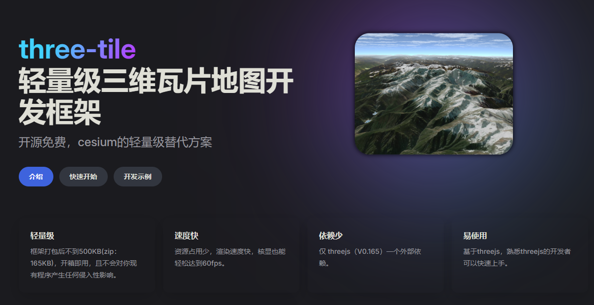
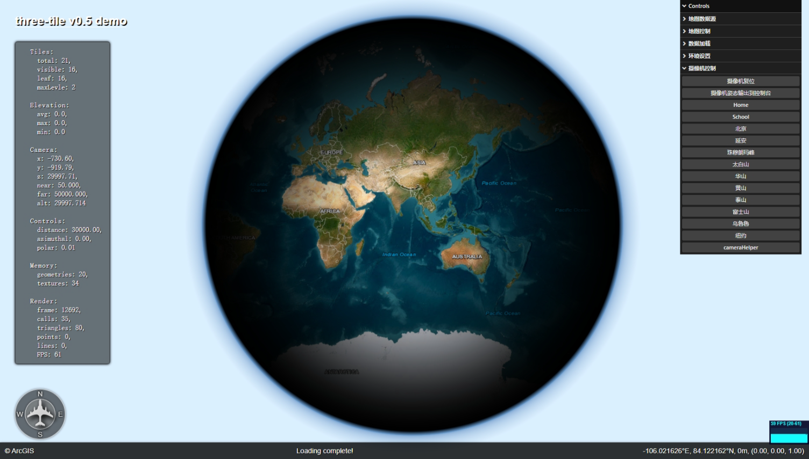
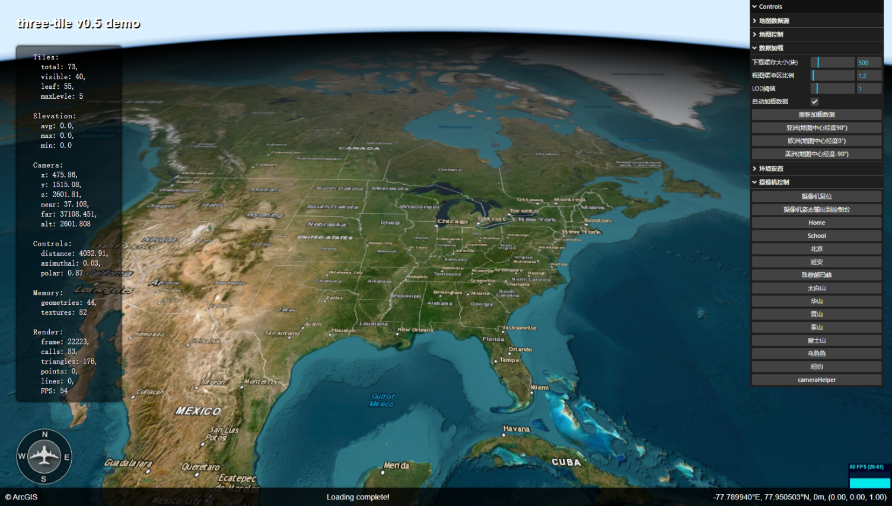
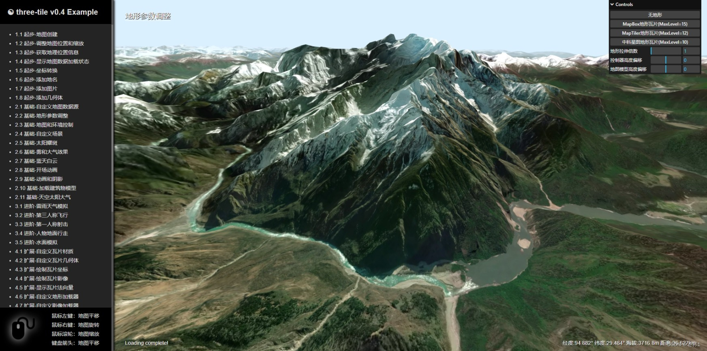
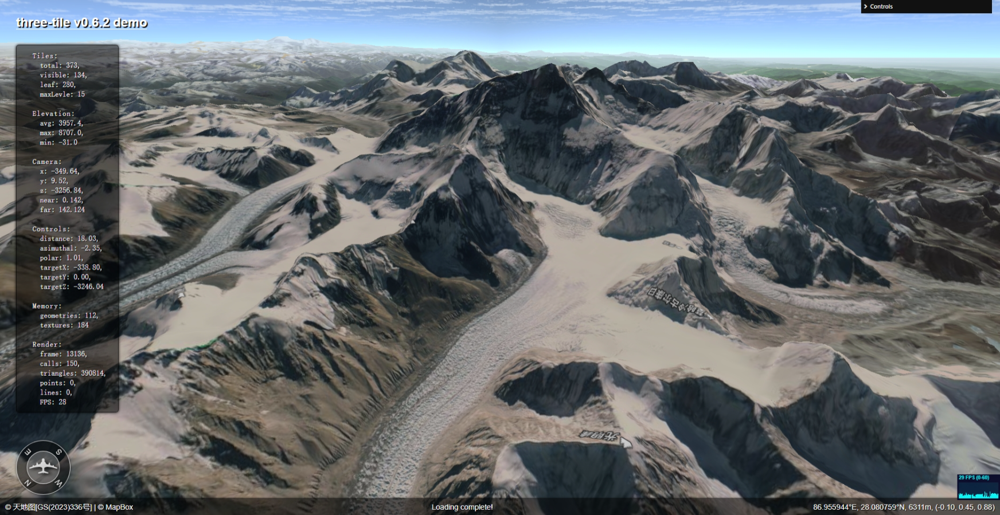
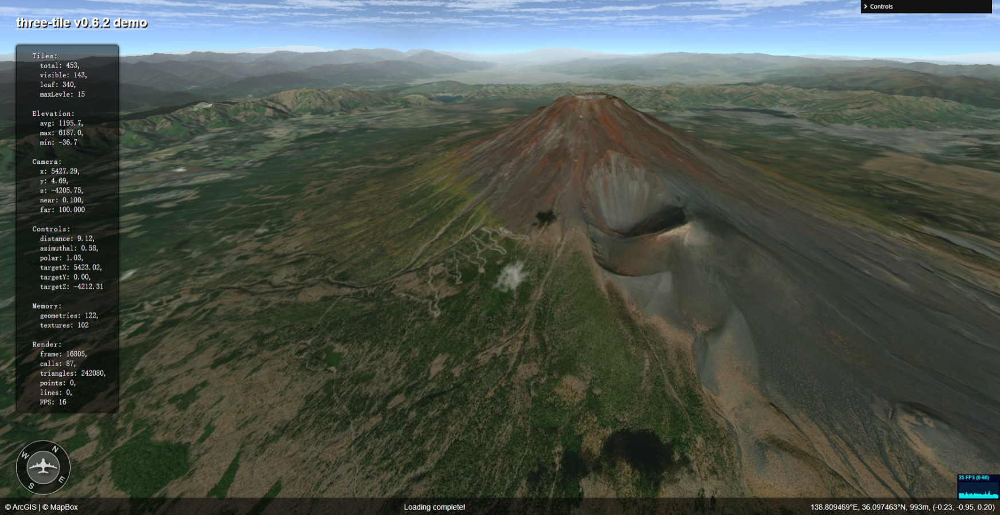
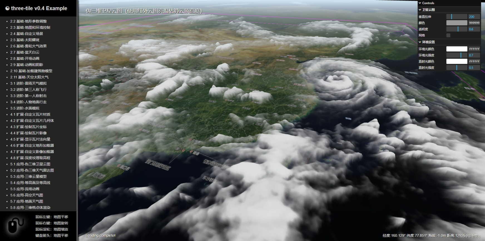

[English](README.md) | [简体中文](README_CN.md)

# **three-tile V0.11.0**

hz_gjf@163.com

## 文档、示例：

{:target="\_blank"}

## 1 简介

three-tile 是一个基于 [threejs](https://threejs.org/)开发的轻量级三维瓦片地图库，具有使用简单、资源占用少等优点，它提供了一个轻量级三维地形模型，适用于给基于 threejs 开发应用添加三维地图。

详细介绍：https://blog.csdn.net/HZGJF/article/details/140280844

注意：这不是 Cesium，也不是 Mapbox-gl，跟这些三维 GIS 框架没有关系。

Source: https://github.com/sxguojf/three-tile

demo: https://sxguojf.github.io/mydemo/three-tile/index.html

提供一些开发示例：

Examples Source： https://github.com/sxguojf/three-tile-example

Examples: https://sxguojf.github.io/three-tile-example

使用 vue 开发：

https://sxguojf.github.io/mydemo/three-tile-vue/index.html

|                                 |                                 |
| -------------------------------------------------------------- | -------------------------------------------------------------- |
|                                 |  |
|  |                                 |

免责声明：

- 本框架不含任何地图数据，Example 中使用的地图均为直接调用第三方数据，使用中请遵循法律法规要求。

### 1.1 特点

- 轻量级：地图以一个三维模型方式提供，不会对已有程序架构产生任何影响。
- 依赖少：整个框架仅有 threejs（R165）一个依赖。
- 速度快：对资源占少，核显也能轻松跑到 60FPS。
- 使用简单：熟悉 threejs 基本上没有学习成本。
- 扩展性强：数据、模型、纹理、材质、渲染过程均能根据自己需要扩展和替换。

### 1.2 开发环境

- 语言：TypeScript 100%
- IDE： VSCode
- 打包：Vite 4.0
- 依赖：three 0.165

---

## 2. 参考

- https://threejs.org/
- https://github.com/CesiumGS/cesium
- https://github.com/mapbox/mapbox-gl-js
- https://leafletjs.com
- https://github.com/tentone/geo-three
- https://github.com/ebeaufay/threedtiles
- https://github.com/NASA-AMMOS/3DTilesRendererJS
- https://github.com/wlgys8/GPUDrivenTerrainLearn
- https://github.com/lijundacom/LeoGPUDriven
- https://github.com/mapbox/martini
- https://github.com/visgl/loaders.gl/blob/master/modules/terrain/src/lib/helpers/skirt.ts
