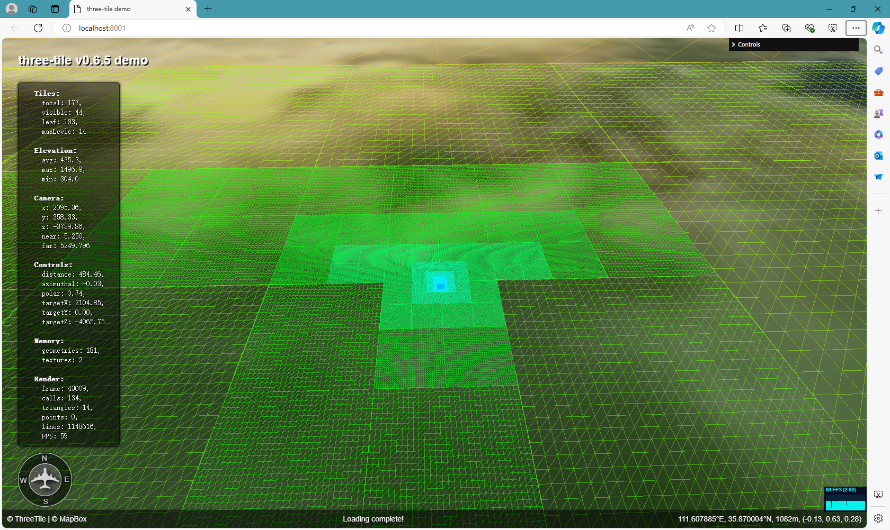
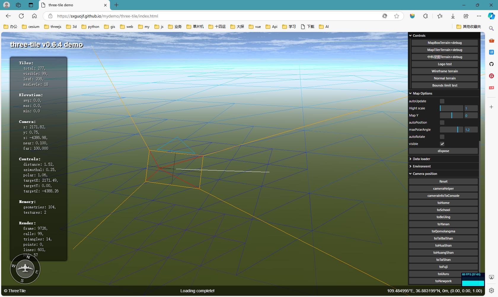

## V0.7 计划

2020 年，单位整体更换信创国产软硬件，X86 电脑只剩了部分十年前的老机 ，开发 three-tile 的原因之一就是想搞一套占用资源低的三维地图开发框架，能在低配置电脑上流畅运行，最好能在信创电脑上运行（想多了）。

在 V0.6.4 之前，three-tile 会严格控制资源占用，基本上做到了极致，牺牲了一些用户体验，最明显的表现就是地图在缩放、旋转中，新进入可视区域的瓦片加载过程会先出现空白块，直到数据加载完成才能显示。

最近突然发现：没几个人还在用我的这种 4G 内存的垃圾电脑了，为支持它牺牲效果得不偿失，同时，为了节省资源，three-tile 的瓦片调度逻辑十分复杂，一些不易捕捉的 bug 始终无法解决。都 2025 了，没必要再追求低资源占用，在 V0.7.0 中重写瓦片调度策略，以用户体验作为首要目标。

---

V0.6.4 及之前版本回顾：

之前，three-tile 以节省资源为首要目标，尽量做到不下载、不保存、不解析、不渲染不必要的瓦片，不必要的瓦片包括两种：

1. 不在可视范围的瓦片
2. 非叶子瓦片

> 主流三维瓦片地图框架，地图瓦片从瓦片树自顶向下顺序加载，不会考虑它们是否在可视范围，也就是看得见看不见的都下载解析保存，资源占用较大，而瓦片树中真正需要显示的仅是可视范围的叶子瓦片，一般仅占总瓦片数量的 30% 左右，甚至更低，理论上来说，如果按需加载渲染会大幅提升运行效率。

three-tile 采用按需加载的瓦片调度策略：

1. 仅构建可视范围瓦片树：仅创建视椎体内的瓦片，这个是必须的。
2. 瓦片树更新与数据加载独立运行：先根据可视范围更新瓦片树，待瓦片树构建完成后再加载可视叶子瓦片数据。
3. 乱序下载：即下载不按瓦片树层级一级一级顺序下载，需要显示那块下载那块，不需要显示的不下载。
4. 用完立即释放：瓦片一旦离开视椎体或成为非叶子瓦片，立即释放，需要显示再重新下载。
5. 下载可以终止：如果正在下载瓦片状态变为非可视或非叶子瓦片，立即中止下载并释放。

设想很美好，但做到并不容易，解决一个问题可能会带来一个更大的问题：

1. 瓦片如果按需加载显示，没有缓存，那么新进入视野中的瓦片需要等数据下载完才能显示出来，会先显示空白块，十分影响体验。
2. 瓦片一旦离开视椎体或成为非叶子瓦片立即释放，需要显示时再重新下载，数据会多次重复下载，故做了一个下载缓存器，保存最近下载的瓦片数据。
3. 子瓦片下载完成后，不能直接显示，需要等它的兄弟瓦片都下载完成，但它的父瓦片可能是爷爷太爷爷级的，子子孙孙一大堆，全部下载完成耗时较长，用户看到的是一片白认为是卡住，无奈子瓦片先显示成了 wireframe 已表示它还活着。
4. 地图在缩放旋转过程中，视野范围变动太频繁，会不断加载、释放瓦片，甚至出现抖动，不得不增加了渲染缓冲区，即在判断瓦片是否在视椎体中时，适当扩大视椎体范围，多加载一些瓦片。
5. 每级瓦片都必须从大到小加载，无法真正做到按需加载，例如瓦片从 2 级放大到 10 级，但它肯定是经过 2-9 级才到的 10 级，虽然 2-9 级一闪而过，但只要经过就会启动下载，下载量减少有限。
6. 设计了多瓦片下载并行，但浏览器限制一个服务地址同时只能有 6 个连接同时下载，超出的会暂时挂起，实际上仍会按请求先后顺序下载。

问题一大堆，费九牛二虎之力解决后，终于能在垃圾电脑上流畅运行，但用户体验变差，程序逻辑也十分复杂，以至于我自己都不敢大动这块代码。

> 相比 cesium 等，你的低资源占用优势没人在乎，甚至感觉不到，缺点却摆在明面一览无遗，是时候改变了。

---

V0.7.0 更新

1. 瓦片树上瓦片改为全部加载，不再判断是否在可视范围。
2. 瓦片创建后立即下载，不再等待瓦片树更新完成。
3. 瓦片用完也不再释放留着做缓存，直到从瓦片树上删除。
4. 渲染缓冲区没有存在必要，现在相当于缓冲区已变成无限大。
5. 因为瓦片用完并不释放，下载缓存也已经不重要，但费了很大劲写出来了，先留着。
6. 瓦片按层级自顶向下顺序加载，加载过程能看到地图一级一级细化过程。
7. 去掉瓦片加载期间的 wireframe 方式显示，计划做个瓦片淡入动画。
8. 瓦片加载器接口删除下载错误回调函数参数，下载错误时按走成功下载回调返回一个特定的瓦片。
9. 增加地理坐标与世界坐标转换函数，前面需要地理坐标->瓦片坐标->世界坐标，现在直接转换。

V0.7.0 重写了瓦片调度策略，删除了大量核心代码，回到了几年前最初的算法，有些伤感，为了这个按需加载熬了多少个深夜，现在全删了。

目前测试效果：

1. 不会出现加载期间的空白瓦片，地图能覆盖全部窗口范围。
2. 因为 threejs 内置视椎体剔除功能，不可视瓦片不会被渲染，不会增加 GPU 负担，对渲染效率影响不大。
3. 因为保存了瓦片树上所有瓦片，内存占用大幅增加，多增加几十兆内存占用，应该没多少人在乎吧？
4. 因为需要下载瓦片树上所有瓦片，数据下载量大幅增加，网速慢的影响较大，但浏览器有下载缓存，仅初次下载较慢。
5. 数据下载后需要解析生成瓦片模型，下载量大意味着瓦片解析计算量大，CPU 负担加重。

---

总结：

1. 创新的想法需要实践才知道是否可行，很多貌似很好的想法主流软件没有采用？不是因为大神们没想到，而是他们试过了不可行。
2. 按需加载瓦片貌似是一个节省资源的好方法，但如果是瓦片需要显示时才开始下载，那就下载过程中瓦片会出现空白，要避免就要预加载即将显示的瓦片，实际上根本无法知道用户下一步会拖动地图到哪里，哪些需要显示，为避免出现空白瓦片，只能是加载保存全量瓦片。
3. 瓦片并行下载貌似可以加快下载速度，但实际上地图的缩放是连续的，虽然中间过程只是过渡一下，但仍需要启动下载（可以中止下载），可以通过将瓦片树更新和数据加载过程分离，等用户操作完成后再下载可视瓦片数据，但会降低地图响应速度，还不如按层级顺序下载，在下载过程中用户还能看到瓦片一级一级细化过程，有更好的体验。
4. 释放非可视瓦片的确能够节省大量内存，但地图缩放旋转中瓦片的加载释放十分频繁，高频的加载释放会拖慢速度，要解决就得做缓存，本想节省内存却加了缓存，增大了内存占用，还不如不释放。
5. 要低资源占用就得牺牲效果，要效果就得增加资源，鱼与熊掌不可兼得，既要...又要...是不存在的。

---

