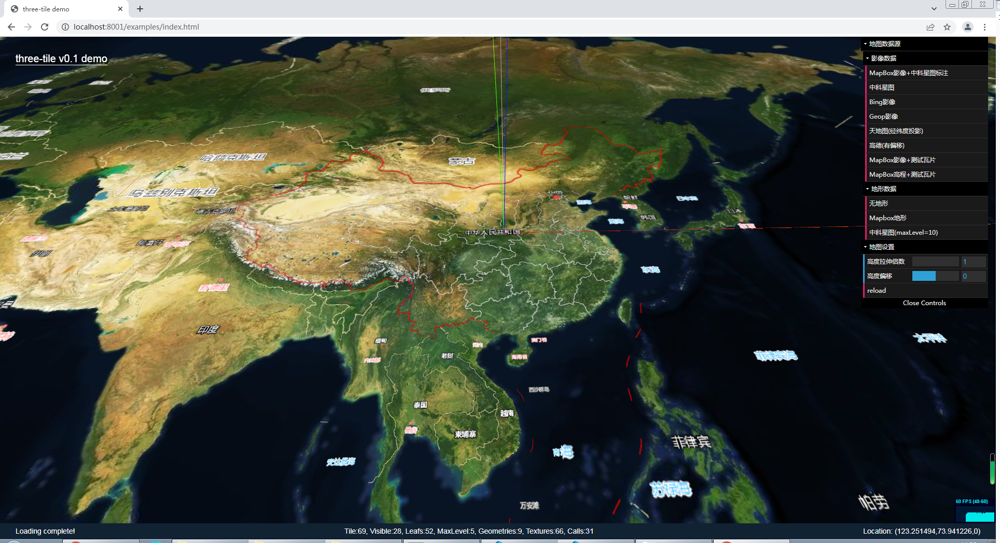
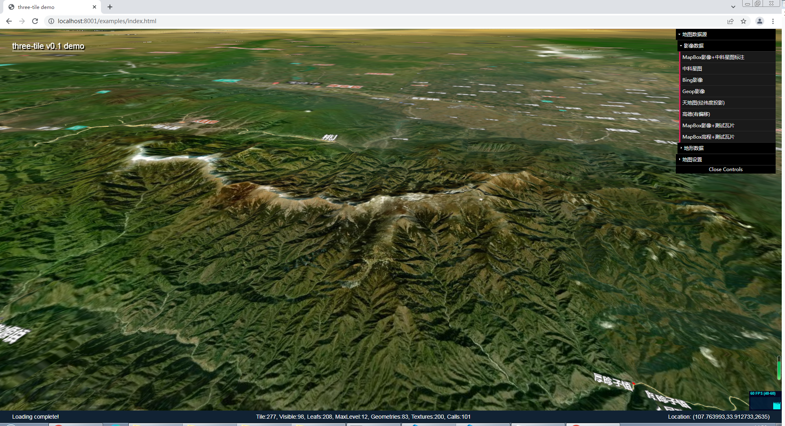
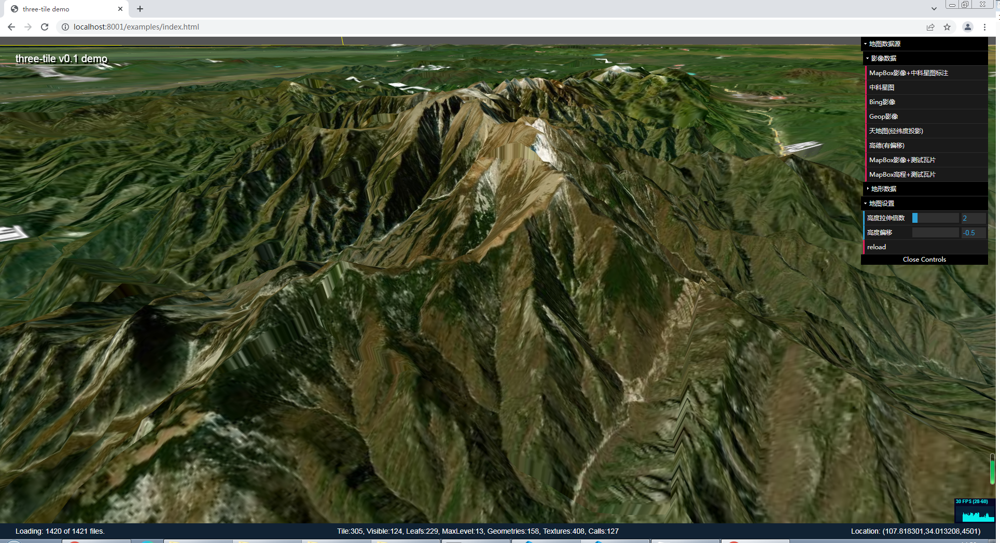
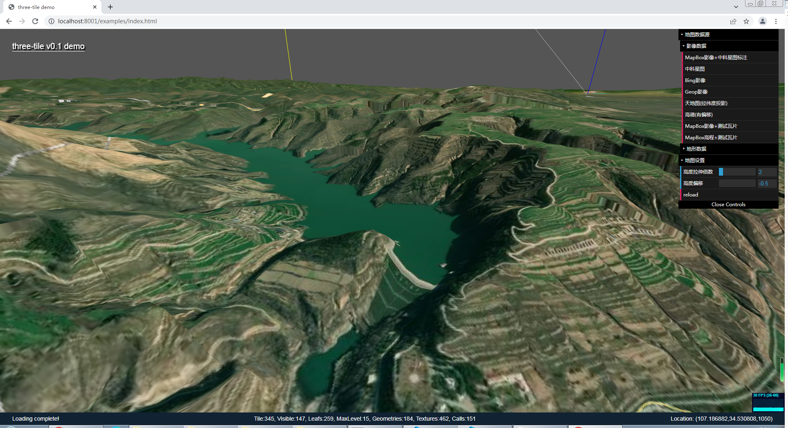
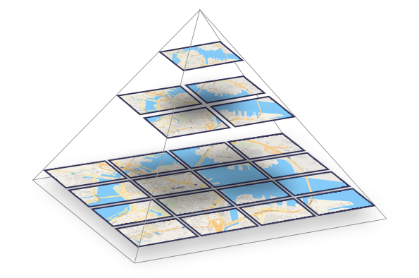
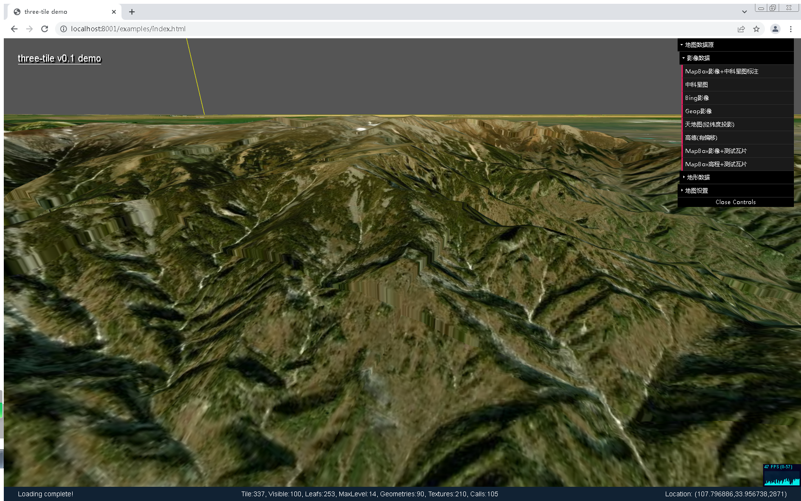
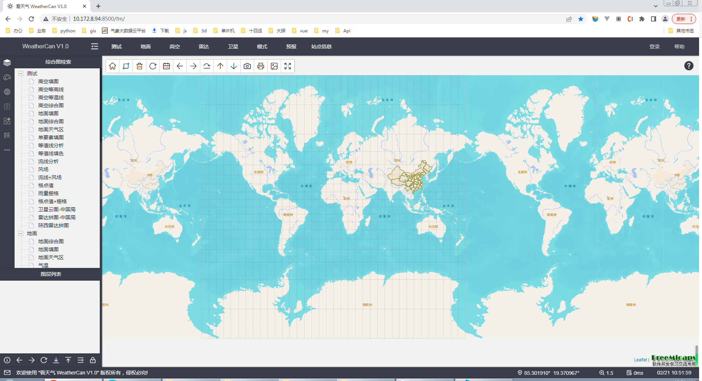
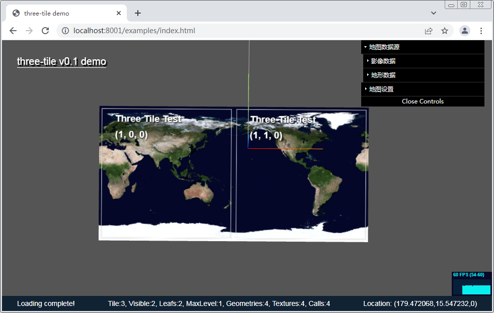
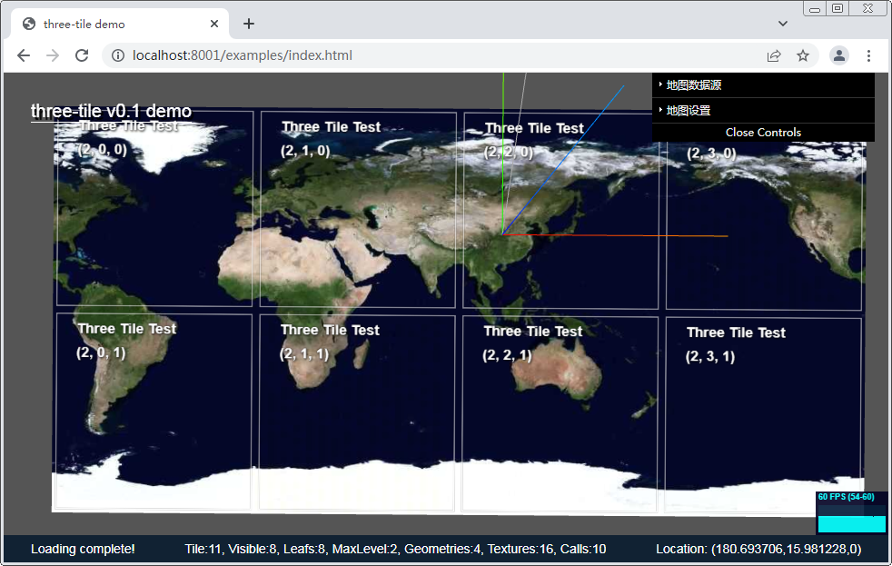

# **three-tile 开发文档** v1.0

郭江峰  hz_gjf@163.com

three-tile 是一个基于threejs的轻量级三维瓦片图开发包，用来实现超大规模三维瓦片的渲染。具有轻量级、速度快、占用资源少的优点，适合给基于threejs的程序增加瓦片地图功能。

|                                |  |
| ----------------------------------------------------------------------------------------- | ----------------------------------------------------------------------------------------- |
|  |  |

## 1.  前言

因业务需求，做过一些数据可视化工作，主要是气象数据可视化。大部分气象数据可视化需要 GIS 支持，随着需求的增加，需要将可视化工作转移到三维场景中。

对于三维webgis框架，cesium无疑是最强大的，虽然它已经做得很好，但其代码结构极其复杂，运行效率偏低。在很多应用中，我们只是需要一张三维地图作为背景，但cesium本身耗费了大部分资源，基于它难以实现更多复杂功能。是否能做一个轻量级框架，实现基本的三维地图功能？

二维瓦片已经十分成熟，市面上百度、高德、天地图、leaflet、mapbox、openlayers等二维地图框架已流行多年，以cesium为代表的三维webgis框架也有广泛应用，google earth、world wind等三维地图客户端深受用户喜爱。二维到三维从理论上来说难度并不大，且有不少可供参考的开源项目，理论是理论，真正动手会发现有无数个坑等你填，从开始构思到实现第一个版本已过去3年。

为了降低开发难度，选择了threejs作为三维框架。threejs封装了webgl基础三维功能，同时也有良好生态，基于它开发难度和运行效率能够做到兼顾。（也尝试使用unity3d，但它应用场景基本上都是游戏，很少有人拿它来做数据可视化，暂时放弃，如果有需求也愿意尝试一下）

在开发中尽量减少第三方依赖，目前仅依赖threejs。

- 语言：typescript
- 打包：vite
- 依赖：threejs

## 2.  使用

虽然three-tile典型应用场景是三维地图，但与常规gis框架不同，它并不是一个gis引擎，没有gis相关的图层、叠加点线面等功能，仅是一个地图三维模型，即threejs的Mesh。使用时需要先按threejs套路创建三维场景，然后将three-tile的地图模型添加到场景中。

### 2.1 安装

   - 直接引用
   - npm install

###  2.2 地图创建

   ```typescript
import * as tt from "three-tile";   
// 创建瓦片图
const map = new tt.TileMap({
    imgProvider: new tt.MapBoxProvider(MAPBOXKEY, "mapbox.satellite", "jpg"),     // 影像数据
    demProvider: ew tt.MapBoxProvider(MAPBOXKEY, "mapbox.terrain-rgb", "pngraw"), // 地形数据
    projection: "3857",			    // 地图投影（仅支持3857和4326）
    projectionCenterLon: 90,		// 投影中心经度
    minLevel: 2,					// 地图最小缩放级别
    maxLevel: 19					// 地图最大缩放级别
});
   ```
TileMap类继承自Mesh，将它的实例map加入threejs的Scene即可实现地图的显示。

### 2.3 地图数据源

three-tile没有自己的地图数据。内置了mapbox、bing、arcgis、天地图、高德、中科星图等瓦片数据源支持。

部分地图数据需要需要在服务商网站注册，拿到注册码才能使用。

   ```JavaScript
   const mapBoxImgProvider = new tt.MapBoxProvider(MAPBOXKEY, "mapbox.satellite", "jpg");
   const mapBoxDemProvider = new tt.MapBoxProvider(MAPBOXKEY, "mapbox.terrain-rgb", "pngraw");
   ```

如果要使用three-tile未提供支持的地图数据，可根据地图服务商瓦片规则自定义数据源。如自定义天地图数据源：

   ```typescript
import { Provider } from "./Provider";   
type Style = "img_w" | "cia_w" | "cva_w" | "ibo_w" | "ter_w" | "vec_w" | "img_c" | "cia_c";   
export class TDTProvider extends Provider {
       public name = "天地图";
       public apiKey: string = "";
       public style: Style;
       constructor(apiKey: string, style: Style = "img_w") {
           super();
           this.style = style;
           this.apiKey = apiKey;
       }
       public getUrl(zoom: number, x: number, y: number) {
           return ` http://t0.tianditu.gov.cn/${this.style}/wmts?SERVICE=WMTS&REQUEST=GetTile&VERSION=1.0.0&LAYER=img&STYLE=default&TILEMATRIXSET=c&FORMAT=tiles&TILEMATRIX=${zoom}&TILEROW=${y}&TILECOL=${x}&tk=${this.apiKey}`;     
       }
}
   ```

注：地形仅支持Mapbox的RGB瓦片结构数据。详细使用方法见example

### 2.4 地图坐标系

three-tile支持兰布托和经纬度两种投影方式（需要相应投影的瓦片数据配合），默认为兰布托投影，使用公里为单位，经纬度投影使用0.01度为单位；坐标轴x轴指向东，y轴指向北，z轴指向天顶。

为了将其它地图元素、模型叠加到地图上指定位置，TileMap类提供了坐标转换方法，用于将经纬度转为为三维场景坐标，如调整摄像机位置到指定经纬度：

   ```typescript
// 经纬度(108.942, 34.285)转三维场景坐标
const center = map.projct(108.942, 34.285);
// 摄像机定位于该经纬度上空15km
camera.position.set(center.x, center.y, 15000);
// 控制器中心点定位在该经纬度
controls.target.set(center.x, center.y, 0);  
   ```

### 2.5 地图控制

地图需要缩放、平移、旋转，可以直接使用threejs自带的MapControl类，直接添加进场景即可。

```typescript
 //控制器
 controls = new MapControls(camera, container);
 controls.target.set(0, 0, 0);
 controls.minDistance = 0.3;
 controls.maxDistance = 30000;
 controls.zoomSpeed = 2;
```

### 2.5 threejs场景的创建

和threejs提供的大多数demo一样，three-tile中三维场景也是需要自己创建的，可参考threejs文档。需要注意下面几点：

- 必须要有光照：地图材质继承MeshLambertMaterial实现，没有灯光会漆黑一片。
- 摄像机的正方向需要与Z轴平行：threejs默认场景中，Y轴指向上方，Z轴指向屏幕外，换成地图就是Y轴指向天顶，Z轴指向南，而以人类的习惯，X轴要指向东，Y轴要指向北，Z轴要指向天顶，正常情况下旋转一下坐标系即可，但旋转坐标系后MapControl的方向会发生错乱，所以通过调整摄像机方向来避免这个问题。

```typescript
// 创建摄像机
camera = new PerspectiveCamera(70, 1, 0.05, 50000);
camera.position.set(0, 0, 15000);
// 修改摄像机Z轴方向（以Z轴为上方）
camera.up.set(0, 0, 1);
```
three-tile也提供了一个三维场景创建函数，但它通用性不强，在正式应用时应自己写场景创建过程，以实现更多个性化控制。详细使用可参考Example。

## 3. 基本架构  

three-tile的核心是一个Tile类，Tile继承自Mesh，利用threejs.Object3D类自带的层级结构，构造了一个递归结构的瓦片四叉树，渲染前根据瓦片与摄像机间距离进行动态细分和简化，实现按需创建、删除瓦片，并根据地图影像数据和地形数据对瓦片进行渲染。包含下面三个过程：

- 创建瓦片树
- 加载瓦片数据
- 瓦片渲染

这三个过程均在场景每帧渲染过程进行。为了保证它的流程运行，这三个过程均是是异步且相互独立的。

### 3.1. 瓦片树

瓦片按照四叉树结构来管理，每帧渲染前根据摄像机位置和可视区域对瓦片树进行更新，更新过程：

- 计算瓦片与摄像机距离
- 如果距离小于大于放大阈值，则在该瓦片里创建4个子瓦片
- 如果距离大于小于缩小阈值，则删除该瓦片的4个兄弟瓦片

### 3.2. 瓦片数据

瓦片数据包括影像数据和地形数据，一般有服务商以http方式提供。

   - 将数据加载和几何体材质创建封装成Loader
   - 瓦片更新完成后，遍历瓦片，当瓦片为叶子瓦片且在可视范围内，则根据瓦片坐标加载相应的瓦片数据，子瓦片数据加载完成隐藏父瓦片

### 3.3. 瓦片渲染

根据瓦片数据生成相应的几何体和纹理，配合自定义材质实现瓦片的渲染。

   - 根据瓦片的影像数据，生成纹理和材质
   - 根据瓦片的地形数据，生成瓦片几何体
   - 将几何体和材质赋给瓦片，完成渲染

### 3.4. 封装

   - 为了便于操作，将瓦片树、数据加载器、地图投影等封装到一个TileMap类中，它也是继承自Mesh，这个Mesh作为地图容器与用户交互。


## 4. 技术要点

瓦片地图，顾名思义，就是将地图分成一块块固定大小的图片，拼成一副地图。为什么要这么做？因为地图太大了，全部加载进来，网速、内存、cpu都受不了，所以将地图分成小块，需要显示那部分就取那部分。

### 4.1 瓦片的定义

瓦片是什么，二维模式下，它就是一张图片，三维模式下，那它就是一个三维模型。瓦片地图就是用一块块瓦片拼接组成完整的地图。

瓦片通过级别、行列坐标进行标识，根据标识获取服务器影像和地形数据，生成纹理和几何模型呈现在地图中。three-tile的核心属性方法定义如下：

```typescript
/**
 * LOD瓦片
 */
export declare class Tile extends Mesh<BufferGeometry, Material> {
    // 级别、行列坐标
    readonly level: number;
    readonly x: number;
    readonly y: number;

    // 是否为叶子瓦片
    get isLeaf(): boolean;

    // 是否为可视区域的叶子瓦片
    get isLeafInFrustum(): boolean;

    /**
     * 构造瓦片
     * @param level 瓦片级别
     * @param x 瓦片x坐标
     * @param y 瓦片y坐标
     */
    constructor(level?: number, x?: number, y?: number);

    /**
     * 更新瓦片
     * @param cameraWorldPosition 摄像机世界坐标
     * @param frustum 视椎体
     * @returns
     */
    update(cameraWorldPosition: Vector3, frustum: Frustum, loader: TileLoader): void;

    /**
     * 重新加载瓦片数据
     */
    reload(dispose?: boolean): void;  
}
```

### 4.2. 瓦片树

瓦片结构地图，已有很多文章对原理进行讲解，基本上都是从金字塔结构描述，按专业说法就是一个四叉树，基础内容这里不再赘述。

- 二维瓦片地图中，同一张地图瓦片级别相同，根据地图缩放系数、中心坐标，计算出需要显示哪些瓦片。类似下图：


- 三维瓦片地图，因为地图可以倾斜旋转，同一张地图中每块瓦片的级别都可能不一样，也没有缩放系数这个概念，直接计算瓦片坐标比较困难，一般使用LOD来实现，即根据瓦片离摄像机距离来确定显示哪级瓦片。如下图：


-  threejs内建了LOD类，通过传入不同密度的模型和一张距离模型关系表，即可根据距离控制不同级别模型的显示，但是它需要在创建时一次传入所有模型，显然不适用瓦片地图，地图瓦片数量太多根本无法一次创建完，需要动态创建和销毁。

#### 4.2.1 瓦片树的构建

瓦片按照一个四叉树来管理，每块瓦片的下一级包含四块子瓦片，根瓦片为0级，最高可达20级以上，级别越高，数据越精细，瓦片数量也更多。

可以自己写一个四叉树结构管理瓦片，由于threejs的Object3D->Mesh类，本身就是一个树状结构，具有parent和children属性，所以瓦片直接继承Mesh类即可，以此为四叉树容器，实现瓦片树的管理。



地图瓦片数以亿计，一次创建全部树是不可能的也没有必要，我们仅需要创建可视范围内的瓦片。瓦片树的创建流程如下：

```flow
start=>start: 开 始
createroot=>operation: 创建根瓦片
add=>operation: 瓦片加入场景
visible=>condition: 瓦片是否可视
dist=>operation: 计算瓦片距摄像机的距离系数
tosub=>condition: 距离系数大于细分阈值？
tosmp=>condition: 距离系数小于简化阈值？
createsub=>operation: 创建4块子瓦片，隐藏父瓦片
smp=>operation: 删除4块兄弟瓦片显示父瓦片
end=>end: 完成创建
end2=>end: 完成创建

start->createroot->add->visible
visible(yes)->dist->tosub
visible(no)->end2
tosub(no)->createsub(top)->add
tosub(yes)->tosmp->tosmp(yes)->smp->end
tosmp(no)->end
```

瓦片树的构建、数据的加载，均在Tile.update方法中实现。

#### 4.2.2 瓦片距离计算

瓦片细化或简化的确定，需要计算瓦片与摄像机的距离。threejs的LOD，通过传入每种级别模型的可视距离表控制显示哪个级别模型。而瓦片图我们目的是尽量保持各种级别瓦片在屏幕上的像素大小一致，可以用一个简单的公式计算距离系数进行控制，此系数是一个相对值，避免距离单位差异造成的错误。当然你也可以做一个距离级别表精确控制。

	距离系数 = 瓦片对角线长度/瓦片与摄像机距离
- 当瓦片距离系数小于放大阈值时，细分瓦片，即将其分为 4 个子瓦片
- 当瓦片距离系数大于缩小系数时，简化瓦片，即销毁兄弟瓦片显示其父瓦片

控制瓦片细化/简化需要一个阈值，但仅一个阈值会出现抖动，需要两个阈值形成一个区间，一个控制细化，一个控制简化，距离系数在这两个阈值之间则视为完成。threejs的LOD也有这个问题，它通过hysteresis属性来避免抖动。

#### 4.2.3 瓦片级别和行列坐标计算

瓦片在创建时需要指定级别（level）和行（x）列（y）坐标，根瓦片的level、x、y均为0，每块瓦片的下一级包含四块瓦片，级别和坐标算法如下：

|   **level=parent.level+1;<br />x = parent.x * 2;<br />y = parent.y * 2;**   |   **level=parent.level+1;<br />x = parent.x * 2 + 1;<br />y = parent.y * 2;**   |
| :-------------------------------------------------------------------------: | :-----------------------------------------------------------------------------: |
| **level=parent.level+1;<br />x = parent.x * 2;<br />y = parent.y * 2 + 1;** | **level=parent.level+1;<br />x = parent.x * 2 + 1;<br />y = parent.y * 2 + 1;** |

#### 4.2.3 瓦片树的更新

瓦片树虽然已经构建完成，但用户可能随时都在旋转、缩放地图，哪些瓦片可视，瓦片与离摄像机距离都随时在变换，所以瓦片树需要实时更新。这个过程放在每帧渲染时进行。

通过查看threejs源码，LOD类有一个属性isLOD，当它为true时，WebGLRenderer类在每帧渲染前会调用它的update方法，当给普通Mesh增加isLOD、autoUpdate两个属性，并赋为true时，WebGLRenderer在渲染时也同样会调用Mesh的update方法。

利用这个机制，Tile类的update方法即可在每帧渲染时被调用，在update里完成瓦片树的更新、瓦片数据加载和渲染。

瓦片树在每帧渲染前更新，这个更新频率通常很高，一般在60FPS以上，所以这段代码需要十分高效。更新只判断可视区域的叶子瓦片，这部分瓦片一般也就几十块，只要代码优化好，速度还是可以的。但仍需遍历瓦片树，需要十分高效才行。

注意：实际代码中还对瓦片图进行了封装，即在Tile外又包裹了一层Mesh：TileMap，这个update实际是写在TileMap里的。

#### 4.2.4 瓦片的销毁

瓦片在不再使用时，需要进行销毁。JavaScript作为动态语言，本身具有垃圾自动回收功能，但和大多数CG程序一样，图形图像资源是需要显式回收的。瓦片从瓦片树中删除、移出三维场景，它的几何体材质纹理资源并不会自动释放，需要显示调用Geometry.dispose()/Material.dipose()/Texture.disose()释放。

通过给Tile增加一个dispose方法，递归释放瓦片几何体、材质：

```typescript
public dispose(removeChildren = false) {
        this.showing = false;        
        this.geometry = TileLoader.defaultGeometry;        
        this.material.dispose();        
        this._loaded = false;
        // 递归删除子瓦片
        if (removeChildren) {
            this.children.forEach((tile) => {
                tile.dispose(removeChildren);
                tile.clear();
            });
            this.clear();
        }
}
```

虽然及时销毁瓦片可以节省计算机资源，但是，瓦片树的更新、数据的加载非常频繁，频繁释放加载十分影响速度，所以这块不能过度。后面性能优化会详细讲。

### 4.3. 瓦片数据的加载

瓦片数据包括影像数据和地形数据，一般由地图服务商提供，包括google、arcgis、mapbox、百度、高德、天地图等均提供免费访问，瓦片编号（坐标）规则也大同小异。地形数据麻烦一些，有不同的方案。

#### 4.3.1 影像数据

影像数据使用十分简单，根据瓦片级别、坐标向地图服务器发送http请求，下载完成作为纹理生成材质，赋给瓦片即可。

#### 4.3.2 地形数据

市面上的地形数据有多种方案，cesium 支持 heightMap 和 Quantized-Mesh 两种格式地形，但格式相对复杂，暂未实现。 three-tile 使用 mapbox 的 terrain.rgb 格式地形瓦片服务:

https://docs.mapbox.com/data/tilesets/guides/access-elevation-data/#mapbox-terrain-rgb

虽然它的效率不高，但优点是简单，它使用图像像素r/g/b分量来保存高程数据，通过简单换算即可得到高度：

```javascript
elevation = -10000 + (R * 256 * 256 + G * 256 + B) * 0.1;
```

和影像数据一样，根据瓦片级别坐标下载图像，再取出像素点rgb值换算为海拔高度。

#### 4.3.3 数据下载

地图数据服务采用http服务，可使用jquery、axios、fetch等方式，但既然用threejs，直接threejs官方下载器，尽量减少依赖。

threejs内建了ImageLoader，它直接使用了img元素实现图片的下载，同时，提供了一个LoadingManager对下载进程进行管理，通过它很容易实现瓦片数据下载进度的显示。

一切看上去很美好，threejs已经提供了我们所有想要的功能，但是....

>瓦片树的更新、数据的下载、瓦片的渲染都是异步且相互独立的，设计的流程是这样：
>
> - 瓦片树更新进程：创建瓦片->加入场景->**显示瓦片->隐藏父瓦片**；  
>
> - 瓦片数据加载进程：发出下载请求->生成瓦片纹理->生成材质->**显示瓦片**；
>
>但瓦片创建完成后即加入场景显示，并隐藏了父瓦片，此时该瓦片数据还没有下载完成，瓦片位置会出现一个空白。受网速影响，这个下载过程少则几毫秒，多则十来秒，下载时间不可控。所以这两个进程间需要通信：
>
> - 瓦片树构建进程：创建瓦片->隐藏瓦片->加入场景->**（等待四个兄弟瓦片全部下载完成）**->显示瓦片->隐藏父瓦片；
>
> - 瓦片数据加载进程：发出下载请求->生成瓦片纹理->生成材质->**（置下载完成标志）**；
>
>问题又来了，如果有子瓦片不在可视区域内，并不会加载数据，所以永远不会全部下载完成，我们还需要判断4个子瓦片是否在可视区域内。
>
>删除瓦片时过程相反，同样会出现子瓦片被删除，但父瓦片还没下载完成的情况。
>
>......

总之，瓦片树更新、数据下载、瓦片渲染、瓦片的销毁过程逻辑十分烧脑，稍考虑不周就会出现问题。由于它还是一个异步递归过程，问题的排查、重现、修复十分麻烦。这个过程封装在Tile类中。

#### 4.3.4 数据源

前面已经说过，不同的数据提供商瓦片编码略有不同，所以抽象出一个Provider类，要实现某种瓦片的加载，只需要继承Provider，根据厂商提供的瓦片url编码规则重载getUrl函数即可，如天地图：

```typescript
public getUrl(zoom: number, x: number, y: number) {
    return ` http://t0.tianditu.gov.cn/${this.style}/wmts?SERVICE=WMTS&REQUEST=GetTile&VERSION=1.0.0&LAYER=img&STYLE=default&TILEMATRIXSET=c&FORMAT=tiles&TILEMATRIX=${zoom}&TILEROW=${y}&TILECOL=${x}&tk=${this.apiKey}`;     
}
```

2.3 节有说明，这里不再细说。

#### 4.3.4 下载器封装

参考threejs，数据加载一般都会用一个Loader来封装，three-tile也借鉴这种模式。

由于希望实现多种数据加载器，所以抽象出一个TileLoader类，包含两个抽象函数，分别用来加载几何体（地形）和材质（影像），子类实现这两个抽象函数即可。目前threejs实现了使用着色器加载和使用canvas加载两种Loader。

```typescript

    /**
     * 加载几何体
     * @param _level 瓦片级别
     * @param _x 瓦片x坐标
     * @param _y 瓦片y坐标
     * @returns 几何体:Promise<BufferGeometry>
     */
    public abstract loadGeometry(_level: number, _x: number, _y: number): Promise<BufferGeometry>;

    /**
     * 加载材质
     * @param _level 瓦片级别
     * @param _x 瓦片x坐标
     * @param _y 瓦片y坐标
     * @returns 材质:Promise<BufferGeometry>
     */
    public abstract loadMaterial(_level: number, _x: number, _y: number): Promise<Material>;
```

threejs的TileLoader其实与threejs的Loader略有不同，它并不会像threejs那样直接返回Mesh，而是返回材质和几何体，主要是Mesh（tile）在构建瓦片已经建好了，只需要材质和几何体。

### 4.4 瓦片的渲染

瓦片几何体、材质已经准备就绪，渲染就是将这些组合在一起。

#### 4.4.1 影像的渲染

影像的渲染没有难度，根据图像生成纹理赋给材质，然后加到瓦片上即可。难度主要是可能需要多个影像层叠加，如影像图、地名图、交通图等。多个影像叠加可以使用多重材质来简单实现，但多个材质意味着占用更多资源，所以three-tile使用自定义着色器来实现。

虽然着色器实现速度较快，但着色器中好像不能定义纹理数组，只能硬编码，目前three-tile仅支持两层影像。另外，多个纹理将增加一定内存占用，考虑改成使用canvas合成多个影像后再送入着色器，不知道速度能慢多少，纠结中...

#### 4.4.2 地形渲染

基本的地形渲染也很容易，使用自定义着色器，在顶点着色器里根据高程纹理计算顶点高程，调整顶点坐标即可，由于完全使用GPU，速度非常快，并且所有瓦片的几何体可以使用同一个PlaneGeometry几何体，资源占用也很少。

但不幸的是：我的项目需求需要用到高程，且在地图上叠加数据很多时候也要贴地，地形数据直接送入着色器由GPU出渲染图，js代码无法获取到......

所以，地形的渲染按还是以下流程：

- 下载地形瓦片
- 将地形图绘制到canvas上，取出像素值点阵
- 将像素值转换为高度
- 根据高度构建地形几何体
- 将几何体赋给瓦片

可以看出，这种方式流程复杂，计算量大，每个瓦片是一个单独的几何体，占用资源多。但要取得高程也是没有更好的办法。

#### 4.4.3 瓦片接缝的处理

地图是由一块一块瓦片拼接出来的，二维情况下瓦片之间不存在接缝的，但三维模式由于高度的存在，且相邻瓦片并不是同一级别，在地形变化剧烈时，瓦片间存在明显的接缝。处理这种接缝，网上有多种解决方案：

- 删除顶点法：当相邻瓦片级别不同时，删除高级别瓦片边缘顶点数量，与低级别一致
- 调整顶点位置法：与上一种方法类似，当级别不同时，将高级别瓦片多出的顶点位置调整到临近顶点位置
- 裙边法：给瓦片边缘增加一圈垂直裙边，瓦片几何形状类似一个倒扣的盒子，用裙边掩盖住瓦片间接缝

前两种方法，由于要回溯瓦片树找到相邻瓦片，算法比较复杂，three-tile采用了裙边法，缺点是仅是利用裙边掩盖了接缝，仔细看还是能看出接缝。不过cesium也是采用这种方法，影响不是太大。下图中间瓦片有明显的接缝：



### 4.4 坐标转换及地图投影

瓦片图与地图并无必然联系，瓦片结构可用来实现任何超大图像的浏览。当给瓦片图增加特定的投影/坐标转换功能，与地理坐标建立联系后它就是地图。

three-tile支持兰布托和经纬度两种投影方式。使用哪种投影需要有相应投影的瓦片服务才行，绝大多数web地图使用Web兰布托投影（3857），大多数厂商也只提供兰布托投影瓦片数据服务，目前仅知道天地图提供经纬度投影瓦片。

#### 4.4.1 坐标转换

前面说过，three-tile作为一个轻量级瓦片模型，并不直接提供添加图层、点线面等方法，在地图上添加元素需要使用threejs原有方法。要用threejs添加物体，首先要确定物体的坐标。

地图元素一般使用经纬度坐标，在添加前需先将经纬度转换为三维场景坐标，TileMap提供两个方法进行转换：

```typescript
	 /**
     * 经纬度(4326)转换为投影坐标(3857)
     * @param lon 经度
     * @param lat 纬度
     * @returns 投影坐标
     */
    public projct(lon: number, lat: number) {
        return this._projction.project(lon, lat);
    }

    /**
     * 投影坐标（3857）转换为经纬度(4326)
     * @param x 投影x坐标
     * @param y 投影y坐标
     * @returns 经纬度
     */
    public unProject(x: number, y: number) {
        return this._projction.unProject(x, y);
    }
```

默认情况，场景坐标和地图投影坐标是重合的，从代码也可以看出，坐标转方法直接调用的投影类相应的方法。

#### 4.4.2 高度计算

地理坐标和投影坐标，都以公里为单位，不需要做过多处理，直接将模型高程传入即可。

在三维地图下，地面高度是一个很麻烦的东西，由于地图被切成了瓦片，并不能通过一张高度图直接算出地面的海拔高度。three-tile使用射线法计算高度。取高度分两种情况：

- 鼠标所指处高度：鼠标所指处经纬度实际上就是鼠标所指的瓦片模型的Z坐标，取鼠标处模型信息threejs已经提供，就是三维拾取操作，这里不用过多赘述。

- 指定经纬度高度计算：先将经纬度转换为场景坐标，然后从该坐标上空10km垂直地面做一条射线，该射线与瓦片的交点即为地面高度。
  

 ```typescript
  	/**
       * 获取指定经纬度的地面海拔高度（不精确，取决于所在瓦片的高程精度）
       * @param lon 经度
       * @param lat 纬度
       * @returns 海拔高度
       */
      getAlt(lon: number, lat: number) {
          const pointer = this.projct(lon, lat);
          const origin = new Vector3(pointer.x, pointer.y, 10);
          const raycaster = new Raycaster(origin, new Vector3(0, 0, -1));
          const intersects = raycaster.intersectObjects([this.rootTile]);
          for (const intersect of intersects) {
              if (intersect.object instanceof Tile) {
                  return intersect.point.z;
              }
          }
          return 0;
      }
 ```


很多情况下，我们向在地图上添加一个元素，只提供经纬度经纬度信息，而不愿意提供一个海拔高度，希望直接贴地，所以提了供一个计算指定经纬度处海拔高度的函数，这也是为什么用canvas而不用简单高效的顶点着色器来处理高程的原因。

遗憾的是，这种方法还是有一些局限性，一方面，遍历瓦片计算交点速度慢，更主要的是：不同级别的瓦片高程分辨率不同，地图在缩放过程中瓦片级别是不断变化的，要贴地需要每次渲染前均重新计算高度。暂时的解决办法是在TileMap的的瓦片下载完成事件中取高度....

另外，因为取交点方法速度慢，图片、线、面的贴地功能也难以实现，这个是three-tile致命的弱点。

cesium是采用离屛渲染取深度缓冲方法实现贴地，这种方案速度很快，我虽然基本了解了cesium贴地的原理，但在three-tile里未能实现。

#### 4.4.3 投影计算

地图投影算法，网上有很多，three-tile通过定义一个接口封装投影功能：

```typescript
export interface IProjction {
    centerLon: number;
    mapWidth: number;
    mapHeight: number;
    mapDepth: number;
    project(lon: number, lat: number): { x: number; y: number };
    unProject(x: number, y: number): { lon: number; lat: number };
}
```

具体投影类实现两个投影函数即可，投影代码写的比较烂，就不贴出来了。

#### 4.4.4 投影中心

世界地图中，地图投影中心默认在0经度，欧洲用还可以，其它区域不太适合。比如在中国，我们就想把地图中心调整到东经90°。下图的投影中心在0°：


二维地图中，一般会将地图做成连续的，即将东经180°与-180°连起来，用户感觉不到



cesium地图为一个球，本身就是连在一起的，不存在这个问题。

three-tile并没能把地图做成球，如果按照二维做法，一种方法是增加瓦片树节点，另一种在地图两边各增加一个地图，两种方法均需要增加瓦片浪费资源。所以three-tile采用根据投影中心经度调整瓦片请求坐标的方法。

TileMap构函数参数中，提供了一个projectionCenterLon参数，在请求瓦片时，会根据该参数调整请求坐标，从而达到修改地图中心的功能。

这种方法解决了用少量资源调整投影中心的功能，但也存在一个问题：0级瓦片的切分是从180°开始的，若要将中心调到90E°，需要将瓦片开始位置调整到-90°，而1级瓦片，-90°需要将一块瓦片分成两半，显然是难以做到的。


所以设置投影中心经度功能有限，一般设置成0°、±90°、±45°即可，更细的中心经度在低级别瓦片会不起作用。所幸这样的需求并不多，0°、±90°、±45°已能适用于绝大多数场景。

#### 4.4.5 经纬度投影瓦片

经纬度投影和兰布托投影并没有太大的本质区别。不同投影需要相应影的瓦片数据（目前只知道天地图提供经纬度投影瓦片）。

前面说过，瓦片树是一个四叉树，但经纬度投影没有0级瓦片，直接从1级开始，1级瓦片有两块(见下图)，也就是说并不是一个严格的四叉树。所以在创建瓦片树时，还需要传入一个是否为经纬度投影的参数来确定1级瓦片分几块，本来瓦片与地图包括投影是没关联的，这下硬是扯上关系了，不爽。下图为经纬度投影时的瓦片，经纬度投影地图是长方形的：

  

cesium的解决办法是：根瓦片可以是一个数组，经纬度投影时使用1级的2块瓦片作为根，另外cesium的Provider中可以自己定义每级瓦片的子瓦片数量，很灵活，就是太麻烦。

#### 4.4.6 能否像cesium做成球面地图

**理论上是可以的，将坐标系转换为球面坐标系即可。  **  话虽这样说，但实现起来要比平面复杂太多太多。
比如要画一个立方体，笛卡尔坐标系下，直接用threejs创建个Box放上去就行了，但在球面坐标系下，Box的上下两个面要做成弧面......。

对使用者来说，除了地理坐标系、投影坐标系、场景坐标系外，又增加了一个球面坐标系，所有threejs模型的生态都不能用了。

球状地图，也只是地图在地图在缩小到全球范围才能看出来，略微放大后和平面基本没区别。而做成球状意味着所有threejs模型包括着色器都要重写，没这个能力，不折腾了。

### 4.5 性能优化

基于threejs做一套三维瓦片地图难度并不太难，难的是要做到低资源占用情况下流畅运行，更可能多地给地图上的具体应用留出资源。

影响运行效率除了硬件外（主要是显卡），主要是：网络速度和瓦片数量。

> 俗话说加快3D渲染速度的最高境界就是不渲染，说人话就是看不见的部分就不要渲染

那提高性能的方法主要办法就是不加载和渲染不需要的瓦片！

#### 4.5.1  瓦片树优化

全球瓦片四叉树是一个十分庞大的树。虽然庞大，但我们只用其中一部分，也就是屏幕上能看见那几十个瓦片，弱水三千只取一瓢。递归构建和更新瓦片树采用如下策略：

- 瓦片不可视，该分支即中止构建
- 瓦片虽然不可视，但仍要计算瓦片距摄像机距离，距离大于阈值时对该分支进行精简

即便如此，因为瓦片树需要从根节点一级一级建下去，当地图放大很大时时，瓦片数量会超过500块。这种场景很常见，很多时候我们只需要某小块区域地图。但瓦片树还是傻傻地从0级全球瓦片一级一级构建。

解决这个问题办法是根瓦片可随意指定，而不是使用默认的0级瓦片。这个功能已经实现，但改变根瓦片地图总宽度和高度（KM）不能使用固定的地球周长，要取根瓦片的大小，投影算法需要调整，目前还未完成，所有自定义根瓦片功能暂未开放。

#### 4.5.2 数据加载优化

同样的原则，数据加载策略就是尽量不加载不可视瓦片数据。不需要加载数据的瓦片包括：

- 不可视瓦片
- 非叶子瓦片

流程上，就是先构建瓦片树，构建完成后再加载可视的叶子瓦片，策略很简单，但存在几个难以解决的问题：

- 所有瓦片创建后都先是叶子瓦片，然后才能成为父瓦片（所有的爹都要必然当过娃），那它在叶子瓦片期间就要加载数据，相当于所有的瓦片都要加载数据。
- 瓦片是否可视，需要根据地形判断，是否要加载地形数据又需要根据是否可视判断，死结。
- 瓦片的级别，需要根据根据摄像机与瓦片的距离确定，不加载地形数据距离又无法准确计算，又是一个死结。

第一个问题：three-tile的解决办法是在瓦片树过程中设置更改标志，等待瓦片树多轮（20）更新但瓦片树没有变化后再加载数据，也就是待瓦片树更新完成并基本稳定后再开始加载数据（行话：懒加载）。但这也带来了第二个问题。

第二个问题：不加载地形，瓦片默认是在海拔0米的平面，当地形高差较大且平视时，瓦片是否可视不能准确判断，本应在可视范围的瓦片因无高度会被判断为不可视。如下图所示：


第三问题和第二个问题类似，没有地形，瓦片与摄像机距离计算的海拔0米到摄像机的距离，根据这个距离确定瓦片级别。当地形加载后，距离为实际地形到摄像机的距离，又根据这个距离重新调整瓦片级别。更严重的是调整瓦片级别会先创建一个新瓦片，新瓦片在地形加载前又在海拔0米，又需要调整级别，造成反复抖动。

要优化数据加载需要判断是否可视，判断是否可视又需要先加载数据，难道前面所设计的方案白做了？也不全是。

虽说瓦片的可视和距离需要先加载地形，但实际上仅用每块瓦片的最高最低海拔即可判断，这两个值比起全部地形要少得多。瓦片创建后先取得该瓦片的最高最低海拔，将瓦片默认几何体改为一个Box，根据海拔调整Box的厚度，判断这Box的可视和距离即可。

但瓦片最低最高海拔从哪里来？cesium初期使用heightMap作为地形，后期改为Quantized-Mesh格式，它的数据头文件包含了瓦片的最低最高海拔高度。

three-tile使用的terrain.rgb，这个问题暂时还无法解决，目前仍使用海拔0米的平面作为初始瓦片，在高海拔高程变化地区，会出现瓦片缺失的情况，如上图。

#### 4.5.3 渲染优化

渲染优化通过减少模型渲染、减少Calls、减少模型顶点来实现。减少模型，通过精简瓦片树、减少数据加载基本上已经到头了。

减少Calls的方法是合并模型，但模型的合并也是需要耗时的，瓦片图的模型更新十分频繁，合并的时间超出减少Calls节省的渲染时间，得不偿失。

减少模型顶点这个可以做，付出的代价是降低地形精度。不过如果有了瓦片的最高最低海拔，可以通过高差确定地面的大致起伏程度，如果地面较平坦，模型就不需要太多的顶点了，如果高差较大，就加密顶点。这个暂时还没有完成。

#### 4.5.4 资源优化

资源的优化主要减少内存占用，策略是即用即放：

- 当一块瓦片从叶子瓦片变为父瓦片时，它就不需要显示了，这时可以将它所占用几何体、材质、纹理资源释放
- 当一块瓦片从瓦片树上被删除时，需要及时销毁，否则会造成内存泄露

值得注意的是，即用即放虽然节省内存，但瓦片树在实时更新，上一帧释放，下一帧可能又要用它，释放太快影响运行速度。大部分GIS软件不会这么做，像MapboxGL等还会专门开一块缓存保存这些数据，以提高运行流畅度。

#### 4.5.5 网络优化

瓦片地图的数据量巨大，部分高质量数据服务器在国外，网速对运行影响巨大，有条件的可自建瓦片数据服务。网络优化的策略有：

- 减少数据下载量：减少数据下载前面通过数据加载优化已经基本完成。

- 客户端缓存：客户端缓存是浏览器自带功能，用过一次就能在客户端留下缓存，速很快。

- 服务器端优化：可使用服务器端缓存方式，客户端访问过的瓦片数据在服务器端留下缓存提高下载数据，如开启nginx的cache。

从代码方面优化是一方面，也是是有限的，终极办法还是提高硬件配置。以上优化可能在你的电脑上毫无感觉，我的开发机比较老，显卡为GeForceGT630，通过以上优化，刷新率从10几FPS提高到了60FPS。


