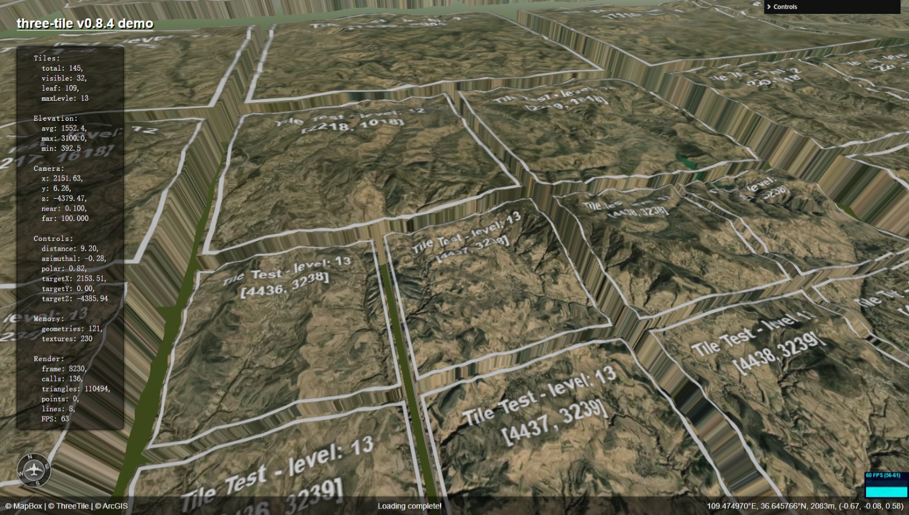
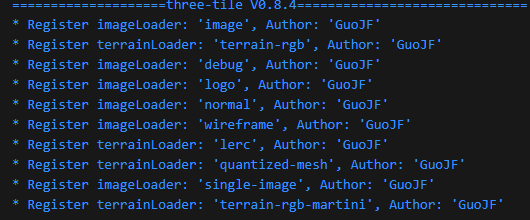
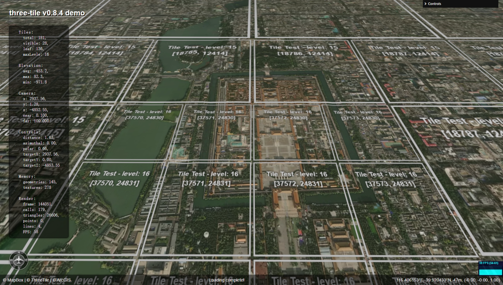
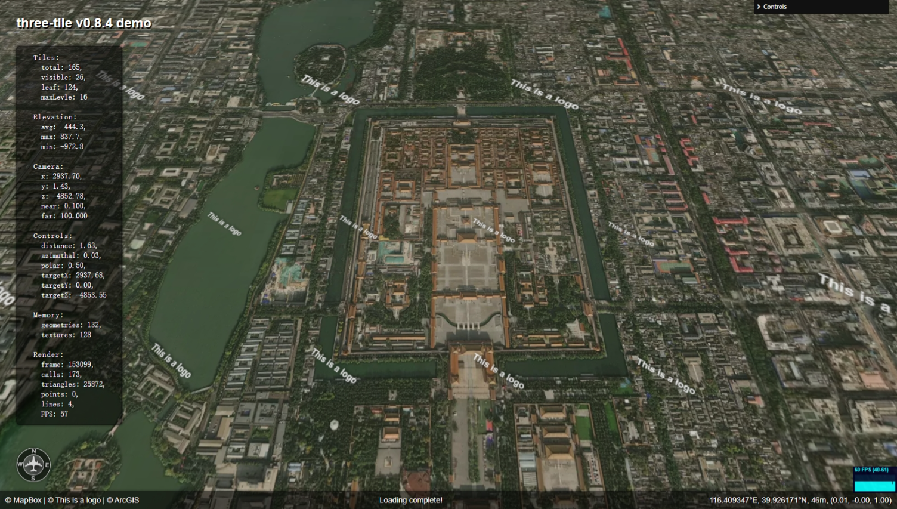
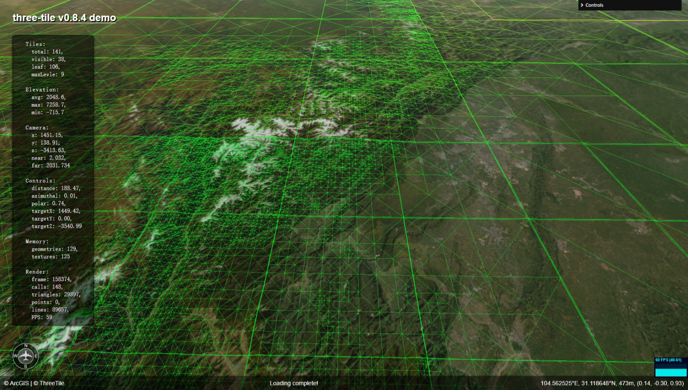
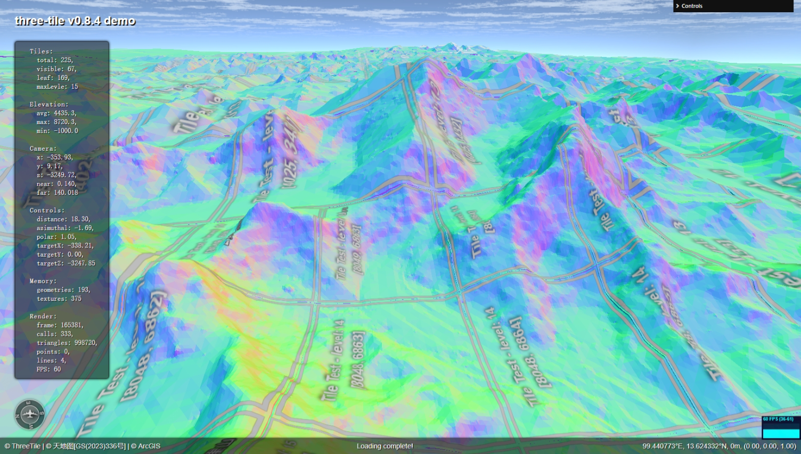

# three-tile 插件开发指南

https://github.com/sxguojf/three-tile

hz_gjf@163.com

## 1. 什么是插件

插件是一种动态扩展程序功能的机制，它允许开发者在不修改主程序代码的情况下，通过编写插件向程序中添加新的功能或特性。

## 2. 插件有什么好处

- 灵活性：插件允许在不修改主程序代码的情况下扩展功能，插件可以是不同人独立开发，更容易单独测试和维护。
- 低耦合：插件与宿主程序强制解耦合，即宿主程序不可能引用插件，必须单向引用，耦合少，宿主可脱离插件运行。
- 易于升级：插件可以单独更新，而不需要重新编译或部署整个程序。

## 3. 如何开发插件

- 在编译型语言中，插件通常是通过动态链接库（DLL）或共享对象（SO）实现。运行时宿主程序会动态加载这些库文件，并通过反射机制实现宿主程序与插件之间的交互。

- 在 JavaScript 等脚本语言中，插件的编写较为容易，几乎与普通模块开发没有区别，只需要遵循宿主程序的一些约定即可。

## 4. three-tile 插件介绍

- three-tile 的架构，就是一个动态 LOD 模型和一些加载器，宿主程序负责瓦片的创建、销毁、调度、渲染等，插件根据宿主传来的参数实现瓦片数据的加载并生成瓦片模型。

- three-tile 插件的主要作用是通过编写加载器，扩展各种格式地图瓦片读取功能。

- three-tile 加载器有三种，一种是影像加载器，实现影像瓦片的加载，返回一个材质。一种是地形加载器，实现地形瓦片的加载，返回一个几何体。还有一种是瓦片加载器，它调用影像加载器和地形加载器将返回结果组合成一个瓦片 Mesh。

- three-tile 加载器编写，遵循 threejs 的加载器代码风格（threejs 内置大量加载器，实现不同格式模型的加载），只需要实现一个 load 函数，根据输入参数返回一个材质（影像）或一个几何体（地形）。

## 5. three-tile 插件开发

### 5.1 three-tile 总体架构

- 三维瓦片地图和二维瓦片地图在设计理念上类似，都是为了解决海量地图数据下载显示问题，将地图切片分块保存为瓦片数据文件，根据层级使用金字塔结构（四叉树）管理，运行时仅加载和渲染可视区域的瓦片以节省资源，最后将多块瓦片模型拼接成一张完整的地图。

- three-tile 的核心是一个动态 LOD 模型，该模型根据摄像机位置和与瓦片的距离，确定需要渲染的瓦片编号，并调用的加载器创建对应的瓦片 Mesh 模型。

瓦片之间留点接缝，看出来什么叫“瓦片”地图了吧：


- 为了简化插件开发，插件中的加载器并不需要生成一个完整的 Mesh 模型，而是只编写影像加载器（材质）或地形加载器（几何体），thee-tile 会通过一个公用的瓦片加载器（TileLoader）调用材质和纹理加载器，并将他们返回的结果组合成一个瓦片 Mesh 模型传给地图。

- three-tile 维护一个加载器列表，保存所有加载器实例，插件引入后，需要向系统注册加载器，如：LoaderFactory.registerGeometryLoader(new TerrainRGBLoader())是向系统注册了一个 TerrainRGBLoader 地形加载器。程序启动时可在控制台看到加载器列表，下图注册了 10 个加载器：

  

- 每个数据源有一个 dataType 属性，每个加载器也有一个 dataType 属性，运行时会根据数据源的 datatype 属性，选取 dataType 值相等的加载器来加载瓦片。

- 总结：加载器插件只需要实现一个 load 函数，根据输入参数（数据源、瓦片 x、y、z 坐标）返回一个材质（影像）或一个几何体（地形），three-tile 会根据数据源的 dataType 属性，选取 dataType 值相同的加载器来生成瓦片。

### 5.2 影像图加载器插件开发

影像加载器实现卫星影像等图像类瓦片加载，它的开发很简单，目标就是创建一个材质，其纹理为瓦片图像。先看内置的影像加载器：

https://github.com/sxguojf/three-tile/blob/master/src/plugin/tileImageLoader/TileImageLoader.ts

```ts
/**
 * Image tile material loader
 */
export class TileImageLoader implements ITileMaterialLoader {
	// 瓦片格式标识，表示当数据源的中dataType为"image"时，使用本加载器加载数据
	public readonly dataType: string = "image";
	// 实现加载函数，根据输入参数返回一个材质
	public load(
		source: ISource,
		x: number,
		y: number,
		z: number,
		onLoad: () => void,
		abortSignal: AbortSignal
	): Material {
		const material = new TileMaterial(); // 创建一个瓦片材质
		material.opacity = source.opacity; // 设置材质透明度
		const textureLoader = new TileTextureLoader(); // 创建一个瓦片纹理加载器
		// 加载瓦片影像，并设置材质纹理
		const texture = textureLoader.load(
			source, // 地图数据源
			x, // 瓦片x坐标
			y, // 瓦片y坐标
			z, // 瓦片z坐标
			() => {
				// 加载完成回调函数
				material.setTexture(texture);
				onLoad();
			},
			onLoad, // 加载失败回调函数
			abortSignal // 加载中断信号，用于中止加载
		);

		return material;
	}
}
```

然后,把 TileImageLoader 的实例向系统进行注册:

```ts
import { LoaderFactory } from "../../loader";
import { TileImageLoader } from "./TileImageLoader";

// 注册影像加载器插件
LoaderFactory.registerMaterialLoader(new TileImageLoader());
```

当数据源 source.dataType 为 "image" 时，系统就会使用该加载器加载影像瓦片。

#### 5.2.1 影像加载器代码解释

影像加载器需要实现 ITileMaterialLoader 接口，该接口定义了一个 load 方法，该方法接收数据源、瓦片 xyz 坐标和回调函数作为参数，返回一个 Material。接口定义如下:

https://github.com/sxguojf/three-tile/blob/master/src/loader/ITileLoaders.ts

```ts
/**  Material loader interface */
export interface ITileMaterialLoader {
	// 瓦片格式标识
	dataType: string;
	//插件作者
	author?: string;
	// load函数
	load(source: ISource, x: number, y: number, z: number, onLoad: () => void, abortSignal: AbortSignal): Material;
}
```

主要是实现 load 函数,它的参数:

- source: 地图数据源, 其中包含了瓦片影像的 url 模板、数据格式等信息
- x, y, z: 瓦片的 xyz 坐标
- onLoad： 加载完成回调函数，当瓦片影像加载完成后，调用该函数通知主程序渲染
- abortSignal：加载中断信号，用于取消加载

影像为图片（jpg、png、webp 等），所以它的加载比较简单: 先创建一个 TileMaterial 材质，然后下载瓦片图像生成纹理，下载完成将纹理赋给材质的 map 属性。瓦片纹理下载已封装在 TileTextureLoader 中，只需调用即可。

#### 5.2.2 内置影像材质

TileMaterial 为内置的瓦片影像材质，它继承自 MeshStandardMaterial，增加了 setTexture 方法用于设置纹理，并重载了 dispose 方法用于释放资源。

https://github.com/sxguojf/three-tile/blob/master/src/material/TileMaterial.ts

```ts
import { FrontSide, MeshStandardMaterial, MeshStandardMaterialParameters, Texture } from "three";

/**
 * Tile material
 */
export class TileMaterial extends MeshStandardMaterial {
	constructor(params: MeshStandardMaterialParameters = {}) {
		super({ ...{ transparent: true, side: FrontSide }, ...params });
	}

	public setTexture(texture: Texture) {
		this.map = texture;
		this.needsUpdate = true;
	}

	public dispose(): void {
		const texture = this.map;
		if (texture) {
			if (texture.image instanceof ImageBitmap) {
				texture.image.close();
			}
			texture.dispose();
		}
	}
}
```

如果你对内置的影像材质不满意，也可以自定义一个材质类，比如写一个着色器，实现个性化效果。

#### 5.2.3 内置影像加载器

three-tile 内置了一些影像加载器插件：

- **debugLoader**：影像瓦片调试加载器，绘制瓦片边框和瓦片编号，使用 CanvasTexture 实现。

https://github.com/sxguojf/three-tile/blob/master/src/plugin/debugLoader/DebugeLoader.ts



https://github.com/sxguojf/three-tile/blob/master/src/plugin/logoLoader/TileMateriaLogoLoader.ts

- **logoLoader**：logo 加载器，绘制 logo 水印，使用 CanvasTexture 实现。



https://github.com/sxguojf/three-tile/blob/master/src/plugin/wireframeLoader/TileMaterialWrieLoader.ts

- **wireframeLoader**：显示瓦片的 wieframe，直接返回一个 wireframe=true 的 BascicMeshMaterial。



https://github.com/sxguojf/three-tile/blob/master/src/plugin/normalLoder/TileMateriaNormalLoader.ts

- **normalLoader**：显示地形法向量，直接返回一个法向量材质 MeshNormalMaterial



### 5.3 地形加载器插件开发

相对影像加载器，地形加载器要复杂一些，因为它涉及到地形数据的解析和 geometry 生成。

与影像加载器类似，地形加载器也需要实现 ITileGeometryLoader 接口:

https://github.com/sxguojf/three-tile/blob/master/src/loader/ITileLoaders.ts

```ts
/** geometry loader interface */
export interface ITileGeometryLoader {
	dataType: string;
	author?: string;
	load(source: ISource, x: number, y: number, z: number, onLoad: () => void, abortSignal: AbortSignal): BufferGeometry;
}
```

与影像加载器接口基本一样，唯一不同是 loader 函数返回的是 BufferGeometry。插件要做的是下载、解析地形瓦片数据，并根据地形数据生成一个 1x1 大小的 geometry（地形高度单位是公里）。

地形瓦片数据没有统一的规范，cesium、mapbox、arcgis、google 等厂商均有自己的一套地形数据格式。不同厂家的地形通过编写相应的地形加载器插件支持。

#### 5.3.1 地形加载器抽象基类

为简化地形加载器的开发，three-tile提供了一个地形加载器抽象类TileGeometryLoader，封装了地形加载通用过程，插件只需继承TileGeometryLoader，并实现doLoad和doParse两个方法即可。

- onLoad：数据下载
- onParse：数据解析

需要注意的是，TileGeometryLoader为泛型类，继承时需要指明下载的数据类型，如果下载的为图像，那么泛型参数为HTMLImageElement，如果下载的二进制数据，泛型参数为ArrayBuffer，还有json..xml..等。

```ts
/**
	 * Download terrain data
	 * @param url url
	 * @param onLoad callback on loaded
	 * @param onError callback on error
	 * @param abortSignal donwnload abort signal
	 */
	protected abstract doLoad(
		url: string,
		onLoad: (buffer: TBuffer) => void,
		onError: (event: ErrorEvent | Event | DOMException) => void,
		abortSignal: AbortSignal,
	): void;

	/**
	 * Parse the buffer data to geometry data
	 * @param buffer the data of download
	 * @param x tile x condition
	 * @param y tile y condition
	 * @param z tile z condition
	 * @param clipBounds the bounds of it parent
	 * @param onParse callback when parsed
	 */
	protected abstract doPrase(
		buffer: TBuffer,
		x: number,
		y: number,
		z: number,
		clipBounds: [number, number, number, number],
		onParse: (GeometryData: GeometryDataType | Float32Array) => void,
	): void;
```

#### 5.3.1 Mapbox 的 terrain-rgb 地形加载器

terrain-RGB 格式说明见：

https://docs.mapbox.com/data/tilesets/reference/mapbox-terrain-rgb-v1/

terrain-RGB 使用图像 RGB 三个通道来保存地形海拔高度信息,下载瓦片图像后，需要读出瓦片 RGB 三个分量，然后组合成一个海拔高度。

https://github.com/sxguojf/three-tile/blob/master/src/plugin/terrainRGBLoader/TerrainRGBLoader.ts

1. **泛型参数**：terrain-RGB数据实际上就是图片，使用ImageLoaderEx下载， 泛型参数为HTMLImageElement。

2. **数据下载**: doLoader中直接调用ImageLoaderEx.loade()下载数据。

3. **数据解析**：实现doParse方法，将图片RGB数据转换为高程数组（DEM）。RGB转高程公式：
   $$height = -10000 + ((R * 256 * 256 + G * 256 + B) * 0.1)$$

   > 需要注意的是，当瓦片的层级大于数据数据源的最大层级时，需要从数据源最大层级瓦片中取出当前瓦片对应区域的数据，比如 mapbox 地形的瓦片的最大层级只到 15 级，当地图缩放的 15 级以上时，就需要从 15 级的瓦片中裁剪出当前瓦片的区域数据，所以，doParse方法中有clipBounds的参数，表示需要从父瓦片中剪裁的范围。

   > 另外，地形几何体并不需要也没必要每个像素都对应一个顶点，大量的顶点会极大影响渲染速度，而效果也不会因为顶点多好多少。需要对顶点重采样抽稀，本插件目前采用简单地图像缩小来实现重采样。

#### 5.3.3 ArcGIS 的 lerc 地形加载器

> LERC（Low-Effort Raster Compression）是由 Esri 开发的一种轻量级栅格数据压缩算法，旨在以较低的计算成本实现高效的数据压缩与解压。它支持定点数和浮点数的压缩，特别适用于遥感影像、高程模型等地理空间数据，能够有效地平衡压缩比率和解压速度，是处理大数据集的理想选择。

> LERC 瓦片和 terrain-rgb 没有本质上的不同，都是保存 DEM 数据，只是以不同格式存储。所以插件代码也类似：

https://github.com/sxguojf/three-tile/blob/master/src/plugin/lercLoader/TileGeometryLercLoader.ts

lerc 格式地形瓦片格式相对复杂，但 ESRI 提供了一个开源的 lerc 库，使用 C 编写，提供 wasm 和浏览器绑定，用它即可将瓦片解析为高程数组（DEM）：https://github.com/Esri/lerc

#### 5.3.4 Cesium 的 quantized-mesh 地形加载器

Cesium 地形瓦片采用的是 quantized-mesh 格式，它是 Cesium 官方开发的一种紧凑型地形数据编码方式，它直接保存瓦片的顶点坐标，并对数据进行了压缩编码，用它生成几何体方法简单（直接得到顶点坐标）、数据量小速度快（矢量数据），数据精度更高（不存在重采样）。

quantized-mesh 格式地形瓦片参考开源代码实现，但由于 three-tile 的瓦片与 cesium 瓦片坐标编码方案不同，cesium 使用 epsg:4326 坐标系，three-tile 使用的是 epsg:3857 坐标系，市面上没有现成的 quantized-mesh 3857 投影瓦片，主流瓦片制作工具也不支持，所以暂时放弃。

https://github.com/sxguojf/three-tile/blob/master/src/plugin/qmLoader/TileGeometryQmLoader.ts

### 5.4 彻底重写瓦片加载器

前面说了，three-tile 是由一个动态 LOD 模型+一个瓦片模型加载器（不是插件中的加载器）组成，这个瓦片模型加载器通过调用影像加载器和地形加载器生成瓦片模型 Mesh，出入 LOD 模型进行渲染显示。我们可以自行实现一个瓦片模型加载器，以完全控制瓦片加载过程。

TileMap 构造函数中可以指定瓦片模型加载器，所以你完全可以自己写一个瓦片模型加载器，自行实现瓦片数据下载、解析、几何体生成逻辑，甚至能重写一套插件框架。实际上这个过程也很简单：

https://github.com/sxguojf/three-tile-example/blob/master/src/step4.3/MyLoader.ts

```ts
import { BufferGeometry, CanvasTexture, Material, MeshPhongMaterial, PlaneGeometry } from "three";
import * as tt from "three-tile";

export class MyLoader extends tt.TileLoader {
	/**
	 * 加载几何体
	 * @param tile 要加载数据的瓦片
	 * @param onLoad 加载完成回调
	 * @returns 几何体
	 */
	public loadGeometry(_x: number, _y: number, _z: number, onLoad: (geometry: BufferGeometry) => void) {
		const geometry = new PlaneGeometry();
		onLoad();
		return geometry;
	}

	/**
	 * 加载纹理
	 * @param tile 要加载数据的瓦片
	 * @param onLoad 加载完成回调
	 * @returns 纹理
	 */
	public loadMaterial(x: number, y: number, z: number, onLoad: (material: Material[]) => void) {
		const material = new MeshPhongMaterial();
		material.map = new CanvasTexture(drawTile(x, y, z));
		onLoad();
		return [material];
	}

    // 绘制瓦片图案
    function drawTile(x: number, y: number, level: number) {
        const size = 256;
        const canvas = new OffscreenCanvas(size, size);
        const ctx = canvas.getContext("2d")!;
        if (ctx) {
            ctx.strokeStyle = "#ccc";
            ctx.lineWidth = 2;
            ctx.strokeRect(5, 5, size - 10, size - 10);
            ctx.fillStyle = "#ccc";
            ctx.shadowColor = "black";
            ctx.shadowBlur = 5;
            ctx.shadowOffsetX = 1;
            ctx.shadowOffsetY = 1;
            ctx.font = "bold 20px arial";
            ctx.textAlign = "center";
            ctx.fillText(`一块瓦片`, size / 2, 60);
            ctx.fillText(`坐标(${x}, ${y}, ${level})`, size / 2, 100);
            ctx.fillText(`采用googles scheme`, size / 2, 140);
        }
        return canvas; //.transferToImageBitmap();
    }

}
```

MyLoader 继承 tt.TileLoader，重写了 loadGeometry 和 loadMaterial 方法，分别生成几何体和纹理。然后在创建地图时，给 TileMap.loader 为新的瓦片模型加载器即可：

```ts
// 创建地图对象
const map = new tt.TileMap({
	// 自定义加载器
	loader: new MyLoader(),
	imgSource: imgSource,
	demSource: demSource,
	lon0: 90,
	minLevel: 2,
	maxLevel: 20,
});
```

当然，你的加载器也可以只重载 loadGeometry 和 loadMaterial 中的一个：

https://github.com/sxguojf/three-tile-example/blob/master/src/step4.1/MyLoader.ts
https://github.com/sxguojf/three-tile-example/blob/master/src/step4.2/MyLoader.ts

### 5.4 更多加载器

step4.1-4.7 中有 7 个自定义瓦片加载器和影像加载器、地形加载器插件示例：

- https://github.com/sxguojf/three-tile-example/tree/master/src
- https://sxguojf.github.io/three-tile-example/

## 6. 结语

一个基本的三维瓦片地图并不算太复杂，three-tile 的最初版本仅使用不到 1000 行代码实现了基本功能，而且效果和功能与现在的差不并不大。但为了有一个便于扩展的架构、实现一些细节功能、提高渲染效率、降低资源占用，经过多次迭代重构，代码量已经差不多 10000 行。目前我觉得架构还是比较合理的，模型功能划分，耦合关系、扩展方式都是非常清晰。但由于考虑到向下兼容，一些地方还是略有遗憾：

1. 地形高度使用公里为单位，这与主流 GIS 软件不同，人家都使用米。原因也很可笑，当时主要是嫌用米为单位 0 太多麻烦...,虽然解决它很简单，但改为米后会于老版本不兼容。
2. 影像插件与地形插件相互独立，处理影像时无法访问地形数据，处理地形时也不能访问影像数据。比如要根据地形来渲染影像，实现起来会很麻烦。要实现加载器间数据的交互，需要修改加载器接口，所有加载器都要修改，无法兼容老版本。

改还是不改？ 纠结中....
